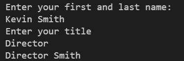

# 1-4 Exercise 2

### The assignment
Edit the file named "student.py". Create a program that takes in a first and last name in one string variable, and a title then returns their title and their last name. Hint: You may need to use the find string method in python.
 

## IMPORTANT  
The testing will only work if you use the input statements for user instructions. If you use extra print statements it will not work.  

## Check your work
Select the "Actions" tab on GitHub and select your latest commit. This will show you if your exercise passes all test cases.
